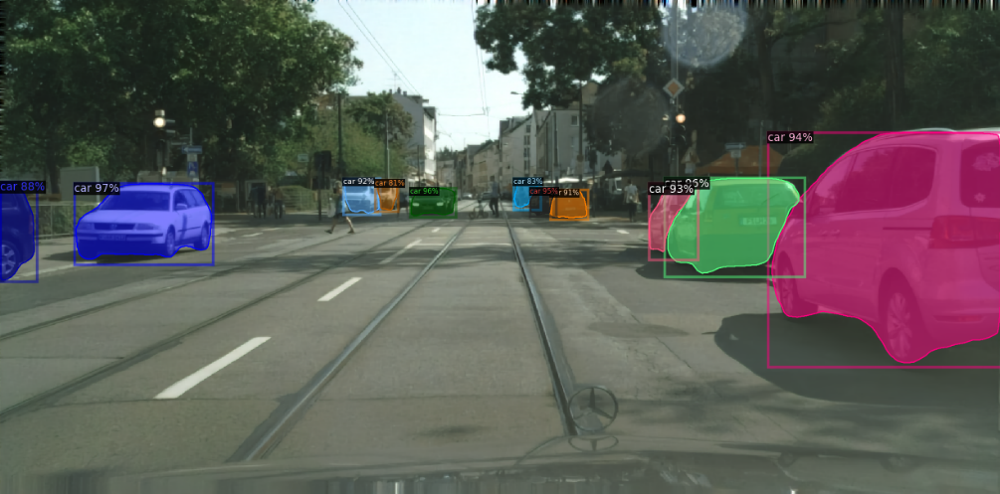
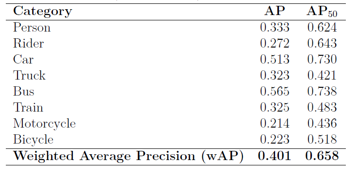
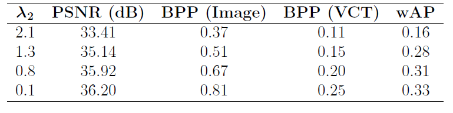
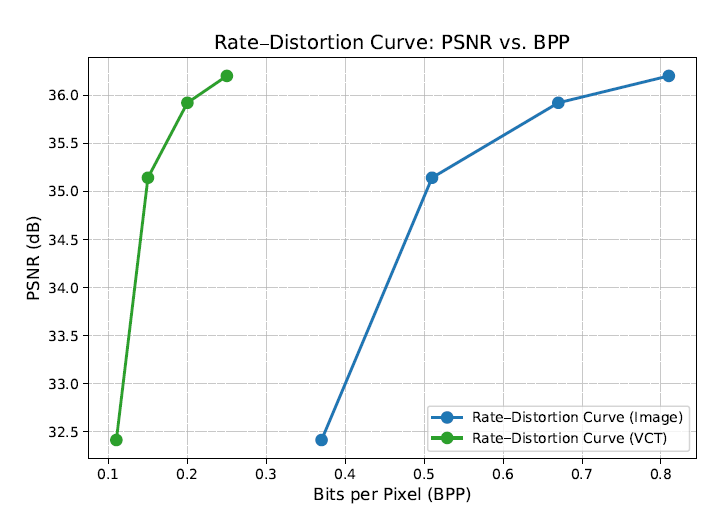
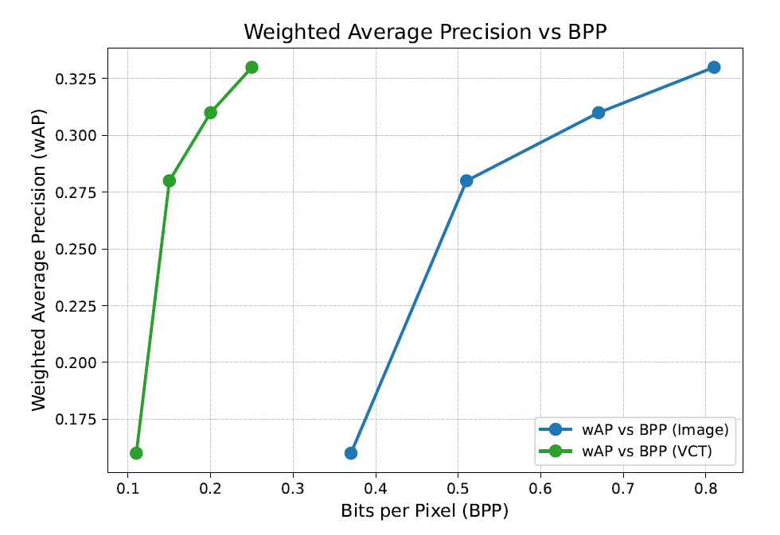

# Custom ELIC/Mask R-CNN for Instance Segmentation (Detectron2-based) - _transformer-video-coding-Part1_

This is part of my research internship at FAU. It explores instance segmentation using a custom Mask R-CNN pipeline built on top of Detectron2. It includes training/evaluation scripts, reproducible configs, and utilities for dataset preparation and inference.

The serves as the first (and standalone) part of the project. It merges ELIC based image compression with the Detectron2's Mask-RCNN for VCM. The second part consists of transferring the trained ELIC weights into FAIR's VCT module.

# Environment setup

Please refer to README_detectron2.md and INSTALL.md for environmental set up and requirements. Additionally,
compressAI package is also required.

# How to run

The project uses the Cityscapes dataset. Use main4.py to launch the training loop. You don't have to register the Cityscapes dataset, as the train and validation pickle files are already generated from the Cityscapes dataset and provided here.

Within main.py, you can alter _self.lambda_rate_ (decrease for increased image quality but worse rate). You do not need to change the _self.alpha_rate_ as it was set empirically.

Finally, select your output directory using: _cfg.OUTPUT_DIR_ and let the training begin.

# Testing

Use single_inference.py to visualize the result from the trained network on provided path to image. You have to provide the checkpoint path in _checkpoint_path_. This contains the trained weights of the model from running main.py. Provide the path to the test image in _image_path_.

Use complete_inference.py to run inference of the trained model on the whole cityscapes validation set. It will output the decompressed images in a new directory set in _output_dir_. The path to the cityscapes validation set must be provided in _input_dir_. The script will also give you the average PSNR and average BPP values accumulated from all 500 images in the validation set.

Use eval_cityscapes.py to test segmentation results on the decompressed images. Add the path to the decompressed images folder (from test5.py) in _"--source"_. Add path to Cityscapes dataset ground truth in _"--gt-path"_. The script will evaluate the Mask-RCNN on the decompressed images and give you the AP values.

# Results
The results shown below are from both _transformer-video-coding-Part1_ and _transformer-video-coding-Part2_:

Instance segmentation being performed on a sample image
from the Cityscapes validation set which is compressed and subsequently
decompressed. Different instances are highlighted
with distinct colors and corresponding class labels. PSNR ~ 34 and bpp ~ 0.3.

Average Precision (AP) and AP at 50% IoU threshold (AP50) for each category
in the original (uncompressed) validation images.

Experimental results: PSNR, BPP (Image), BPP (VCT) and wAP for different
values of λ2.

Rate–Distortion (RD) curve showing PSNR versus BPP for the image-based and the video-based VCT compression model.

Curve showing weighted Average Precision versus BPP for the image-based and the video-based VCT compression model.

# Additional Info:
If you need any checkpoint file, please email me at: harisasif64@gmail.com